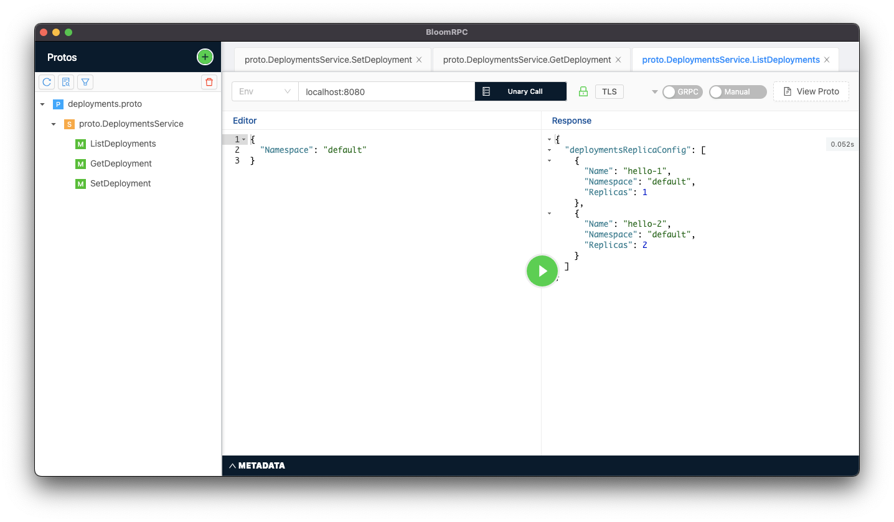

# Replica Count Manager (Teleport SRE Challenge)

Provide an API alongside the native Kubernetes deployment controller to manage the pod replica count of deployment resources.

- List, Set and Get desired replica counts across all namespaces
- Provides a single source of truth for replica counts of all resources
- Deployments and upgrades may reset the replica counts back to a previous number
- Replica counts may be modified by external actors

## Features

- Kubernetes-native
- Helm chart provided
- Served over gRPC
- Supports mTLS

## Installation

Installation is done through Helm.

```bash
helm upgrade --install replica-count-manager replica-count-manager \
  --repo https://not-setup-yet/charts \
  --namespace replica-count-manager \
  --create-namespace
```

See our [Helm docs](https://github.com/calvinbui/teleport-sre-challenge/blob/master/charts/replica-count-manager/README.md) for a full list of variables.

## Usage

Once installed, the application can be reached at port `8080`. A port-forward may first be necessary (`kubectl port-forward --namespace replica-count-manager service/replica-count-manager 8080 8080`).

The application communicates over [gRPC](https://www.grpc.io/). Tools such as [grpcurl](https://github.com/fullstorydev/grpcurl) and [BloomRPC](https://github.com/bloomrpc/bloomrpc) can be used as clients to interact with application.

```bash
grpcurl \
  -cacert certificates/ca/ca.crt \
  -cert certificates/client/client.crt \
  -key certificates/client/client.key \
  -d '{"Namespace": "my-app-namespace"}' \
  -proto proto/deployments.proto \
  localhost:8080 \
  proto.DeploymentsService.ListDeployments
```



The following endpoints and messages are available:

- proto.DeploymentsService.ListDeployments: Returns all deployments and their replica count that this application manages.

    ```json
    {
      "Namespace": "default"
    }
    ```

- proto.DeploymentsService.SetDeployment: Set the desired replica count of a Kubernetes deployment resource and have this application managing it.

    ```json
    {
      "Name": "kubernetes-dashboard",
      "Namespace": "kubernetes-dashboard",
      "Replicas": 1
    }
    ```

- proto.DeploymentsService.GetDeployment: Get the replica count (desired and current) of a deployment this application manages.

    ```json
    {
      "Name": "Hello",
      "Namespace": "Hello"
    }
   ```

## Contributing and Developing

Please see our [Contributing guidelines](https://github.com/calvinbui/teleport-sre-challenge/blob/master/CONTRIBUTING.md) for more info.

## TODO / Future Improvements

- [See Design doc](https://github.com/calvinbui/teleport-sre-challenge/blob/master/DESIGN.md#possible-future-improvements)

## Links

This application is based off the [Level 5 challenge from Gravitational/Teleport](https://github.com/gravitational/careers/blob/a78b45b4ddd5a513e66a437648b6d8600bb59cfd/challenges/cloud/sre.md)
